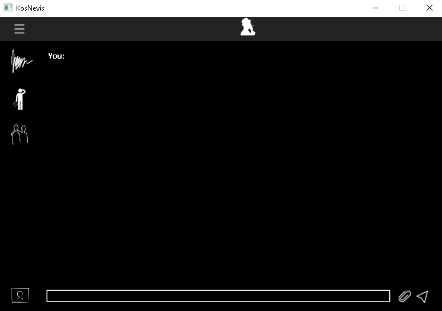

# KosNevis
Say everything, fuck everyone

## Installing requirements:
```
  python3
  PySide2
  PyQt5
```

## After install:
```
After install requirements cd to directory and 
  py main.py
  or
  python3 main.py
  
```

## Please wait for next update and servers.
